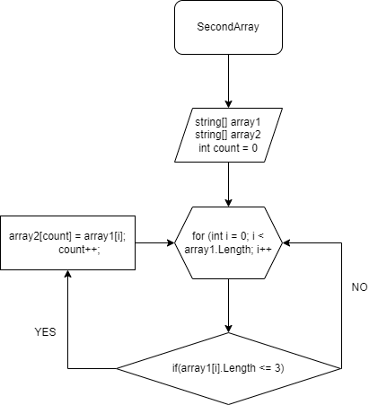

Графическое представление метода файл FinalTask.png

Описание алгоритма решения:
Шаг 1: Создаётся первый массив и вторый такой же длины. 
Шаг 2: Затем метод, в котором цикл for (int i = 0; i < array1.Length; i++ соразмерный длине массива, 
Шаг 3: Внутри цикла проверяется условие if(array1[i].Length <= 3), если ответ положительный то  элемент первого массива заносится в count элемента второго массива. 
Шаг 4: Переменная count поочередно перенолситься из первого массива во второй и убирает пробелы. После присвоения увеличивается переменная count на 1 и возвращается к циклу for в котором i увеличивается на 1. И так проверяется до конца.

Или просто открыть просмотр Марк даун: 
